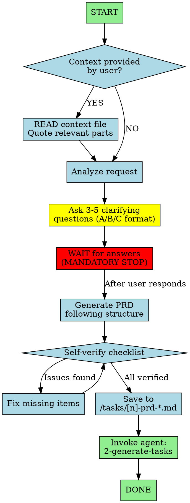
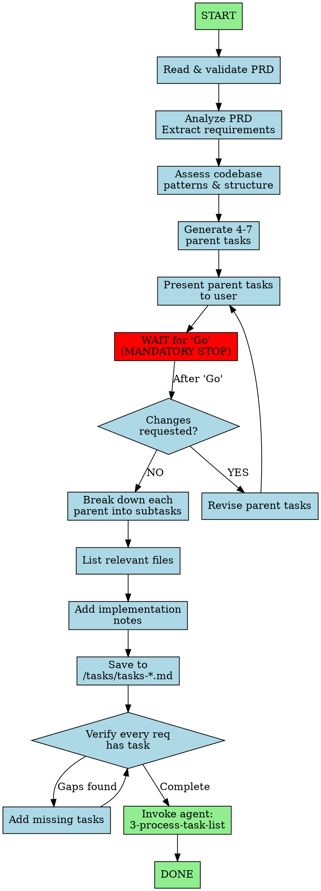
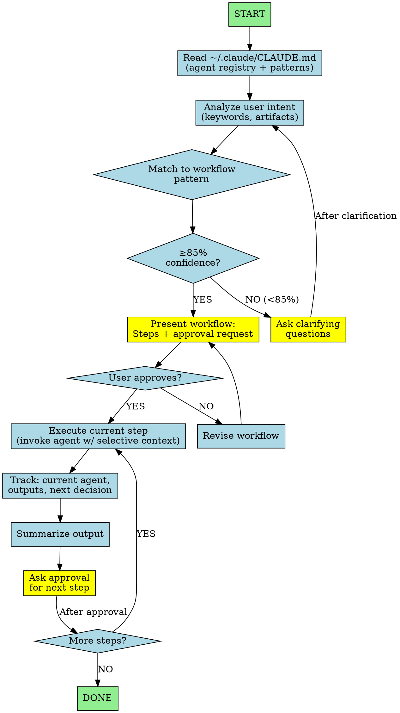
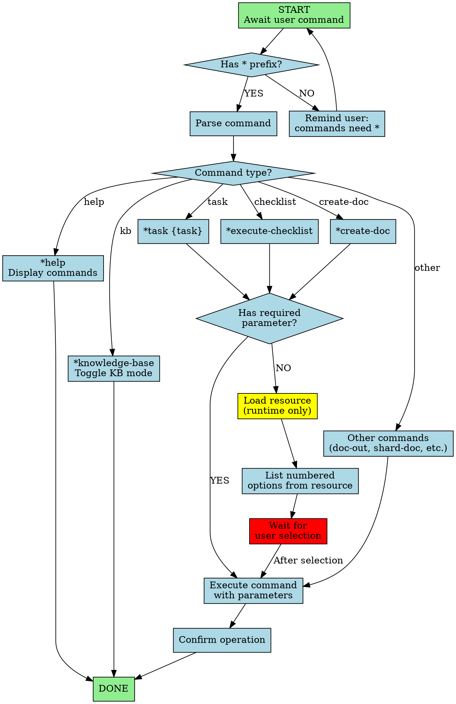
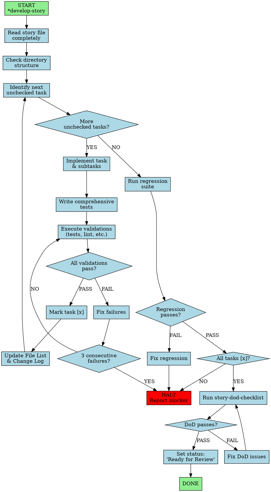
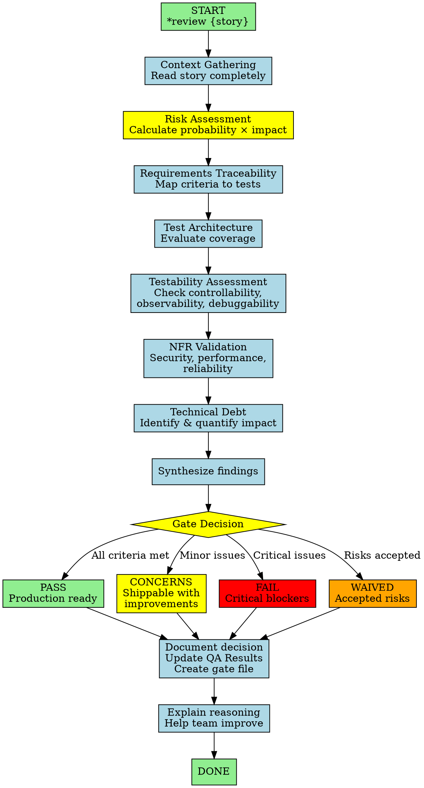

# Plan: Add Diagraph Workflow Visualization to PRD-Tasks-Implementation Agent Trio

## Context

All three agents in the workflow sequence (`1-create-prd`, `2-generate-tasks`, `3-process-task-list`) have strict sequential execution with critical checkpoints, but lack visual workflow documentation. Adding diagraphs would:

1. **Make sequential discipline explicit** - Show that skipping steps is not allowed
2. **Visualize critical STOP/WAIT gates** - Make checkpoints physically visible
3. **Clarify decision points** - When to ask for help, when to verify, when to proceed
4. **Show agent handoffs** - Make it clear when to invoke the next agent in the chain
5. **Help agents follow workflows** - Visual reinforcement prevents skipping steps

## Current Agent Structures

### orchestrator.md
- YAML frontmatter
- Core Rules (5 rules)
- Workflow Patterns (9 patterns listed)
- Intent → Agent Mapping (table)
- Context Injection Rules
- Execution Flow (text steps)
- Conditional Execution Example
- Commands system
- Transformation logic
- Status tracking
- Key Principles

**Critical checkpoints:**
- Read ~/.claude/CLAUDE.md first
- Match intent to pattern (85% confidence)
- Ask before each step (don't auto-advance)
- Get approval between steps
- Track state throughout
- Selective context only

**Complexity:** Very high - orchestrates all other agents, multiple decision trees, conditional branching

### master.md
- YAML frontmatter
- Core Operating Principles (5 principles)
- Commands list (10 commands)
- Resource Dependencies section
- Execution Guidelines

**Critical checkpoints:**
- Load resources at runtime (never pre-load)
- Command requires * prefix
- Present numbered lists for choices
- Execute directly without persona transformation

**Complexity:** Medium - command processor with resource routing

### 1-create-prd.md
- YAML frontmatter
- Core Workflow (6 steps)
- Discovery Questions section
- PRD Structure section
- Writing Guidelines
- Self-Verification checklist

**Critical checkpoints:**
- MUST ask questions
- MUST wait for answers
- MUST verify before saving
- MUST invoke next agent

### 2-generate-tasks.md
- YAML frontmatter
- Two-Phase Process (with explicit STOP)
- Output Format Requirements
- Guidelines
- MANDATORY Verify Subtask section
- Self-Verification checklist

**Critical checkpoints:**
- Phase 1: STOP after presenting parent tasks
- WAIT for "Go" before Phase 2
- MUST verify every requirement has a task
- MUST invoke next agent

### 3-process-task-list.md
- YAML frontmatter
- Critical rules (6 sections, very verbose)
- Task list format example
- Summary section

**Critical checkpoints:**
- NEVER skip/jump tasks
- Mark [x] immediately
- Run tests before commit
- COMMIT after each parent
- Ask for help if stuck (don't skip)

## Agent 1: create-prd

### Proposed Diagraph



### What to Remove/Consolidate

**REMOVE:**
- "If user says 'just write it'" paragraph (3 lines) - The diagram shows questions are mandatory
- Redundant emphasis on waiting (line 13) - Diagram has red WAIT node

**KEEP:**
- Discovery Questions list (reference material)
- PRD Structure (reference material)
- Writing Guidelines (how, not when)
- Self-Verification checklist (referenced by diagram)

**Result:** 50 lines → ~45 lines, workflow is now visual

## Agent 2: generate-tasks

### Proposed Diagraph



### What to Remove/Consolidate

**REMOVE:**
- "Say: 'Ready to generate sub-tasks?...'" (line 17) - Diagram shows WAIT node
- "STOP - Wait for 'Go'" (line 18) - Diagram makes this explicit
- Redundant phase separation headers - Diagram separates phases visually

**KEEP:**
- Output Format Requirements (reference material)
- Guidelines section (quality criteria)
- MANDATORY Verify Subtask table (reference)
- Self-Verification checklist (referenced by diagram)

**Result:** 87 lines → ~75 lines, two-phase workflow is now visual

## Agent 3: process-task-list

### Proposed Diagraph

(Already created in `3-process-task-list-new.md`)

### What to Remove/Consolidate

**REMOVE:**
- Section "1. STRICT SEQUENTIAL ORDER" (5 bullets) - Diagram shows no skip paths
- Section "2. MARK TASKS IMMEDIATELY" (details) - Diagram shows mark after execute
- Section "4. CONTINUOUS EXECUTION" (3 bullets) - Diagram shows continuous flow
- "Summary" section (5 recap points) - Diagraph is the summary

**KEEP:**
- Commit rules detail (format, steps, no batching)
- "When Stuck" specifics (reinforces red node)
- Task List Format (reference material)

**Result:** 78 lines → 48 lines, 40% token reduction

## Agent 4: orchestrator

### Proposed Diagraph



### What to Remove/Consolidate

**REMOVE:**
- "Execution Flow" text steps (lines 64-72) - Diagram shows this flow
- Redundant emphasis on "Ask before each step" - Yellow ask nodes make this explicit
- "Key Principles" section overlap with Core Rules - Consolidate

**KEEP:**
- Workflow Patterns list (9 patterns - reference material)
- Intent → Agent Mapping table (reference)
- Context Injection Rules (what to pass to each agent)
- Commands system (*, *agent, *status, etc.)
- Conditional Execution Example (shows conditional branching pattern)
- Transformation logic

**Result:** 139 lines → ~120 lines, workflow is now visual while keeping reference tables

## Agent 5: master

### Proposed Diagraph



### What to Remove/Consolidate

**REMOVE:**
- Redundant emphasis on "Runtime Resource Loading" - Diagram shows load_resource step with "runtime only" label
- Repetitive "numbered lists" mentions - Diagram shows list_options node
- "Execution Guidelines" section that duplicates Core Principles

**KEEP:**
- Commands list (10 commands - reference)
- Resource Dependencies section (which resources exist)
- Core Operating Principles (5 principles)

**Result:** 53 lines → ~45 lines, command routing is now visual

## Agent 6: full-stack-dev

### Proposed Diagraph



### What to Remove/Consolidate

**REMOVE:**
- "Workflow Discipline" section text description - Diagram shows the flow
- Redundant "Before Starting" / "During Implementation" / "Quality Assurance" subsections - Diagram makes these explicit
- "Decision-Making Framework" overlap with workflow steps

**KEEP:**
- Commands list (*develop-story, *run-tests, *review-qa-test-architect, etc.)
- Critical Core Principles (story context, file update permissions)
- Dependencies section

**Result:** 81 lines → ~65 lines, develop-story workflow is now visual with clear halt conditions

## Agent 7: qa-test-architect

### Proposed Diagraph



### What to Remove/Consolidate

**REMOVE:**
- "Review Workflow" text steps (lines 40-50) - Diagram shows this flow
- Redundant emphasis on advisory nature - Kept in principles, removed from workflow description

**KEEP:**
- Core Principles (9 principles including advisory excellence)
- Commands list (*gate, *review, *trace, etc.)
- Gate Decision Framework (PASS/CONCERNS/FAIL/WAIVED criteria - referenced by diagram)
- Communication guidelines
- Dependencies section

**Result:** 73 lines → ~60 lines, review workflow and gate decision logic now visual

## Implementation Approach

For each agent:

1. **Add diagraph section** immediately after YAML frontmatter
2. **Format**: Standard Graphviz DOT syntax in fenced code block
3. **Visual elements**:
   - Diamonds for decision points
   - Red nodes for MANDATORY STOP/WAIT gates
   - Yellow nodes for important actions (ask questions, commit)
   - Green nodes for agent handoffs and completion
   - Clear arrows showing sequential flow with labels
4. **Remove redundant text** that describes workflow steps (now visual)
5. **Keep reference material** (structures, formats, guidelines)

## Why This Helps All Three Agents

**Agent 1 (create-prd) benefits:**
- **WAIT gate is RED and mandatory** - Can't skip asking questions or waiting for answers
- **No path from "start" to "generate" without questions** - Makes interactive discovery non-optional
- **Self-verify loop is visible** - Shows you must fix issues before proceeding

**Agent 2 (generate-tasks) benefits:**
- **Two-phase separation is visual** - Red WAIT node between Phase 1 and Phase 2 makes STOP explicit
- **Revision loop is clear** - Can iterate on parent tasks before breaking down
- **Verification gate prevents gaps** - Diamond shows you must check completeness

**Agent 3 (process-task-list) benefits:**
- **No skip paths exist** - All arrows flow sequentially, no bypass
- **Commit boundary is yellow and explicit** - After mark parent, before next task
- **Stuck handling is RED** - "Don't skip" is visually alarming, not just text

**Agent 4 (orchestrator) benefits:**
- **85% confidence threshold is a diamond gate** - Can't proceed without confidence or clarification
- **Yellow ask nodes at every checkpoint** - "Ask before each step" is structurally enforced
- **Approval loop is visible** - Can revise workflow before execution
- **Track state node** - Explicit reminder to maintain workflow state

**Agent 5 (master) benefits:**
- **Prefix check at entry** - Can't bypass * requirement
- **Command routing is visual** - Clear branches for different command types
- **Runtime loading is yellow** - "Never pre-load" is visually enforced
- **Wait selection is RED** - Must wait for user choice when parameter missing

**Agent 6 (full-stack-dev) benefits:**
- **Task loop is visual** - Implement → Test → Validate → Mark [x] → Repeat
- **Halt conditions are RED** - 3 consecutive failures or regression failure triggers HALT
- **Quality gates are explicit** - Validations, regression, DoD checklist all visible
- **No skipping possible** - Can't mark task complete without passing validations

**Agent 7 (qa-test-architect) benefits:**
- **10-step review flow is scannable** - From context gathering through educational feedback
- **Gate decision branches are color-coded** - PASS (green), CONCERNS (yellow), FAIL (red), WAIVED (orange)
- **Risk assessment is highlighted yellow** - Critical step gets visual emphasis
- **Advisory nature is structural** - Educational feedback at end, not blocking in middle

**Universal benefits:**
- **Agent handoffs are GREEN** - Clearly shows when to invoke next agent in chain
- **Decision points use diamonds** - Visual distinction from action boxes
- **Color coding creates mental anchors** - Red = stop, Yellow = critical action, Green = success/handoff
- **Complex coordination is scannable** - Orchestrator's multi-step flow becomes graspable at a glance

## Critical Files

**Diagraph additions (7 agents):**
- `/home/hamr/.claude/agents/1-create-prd.md` - Add diagraph, remove redundant workflow text
- `/home/hamr/.claude/agents/2-generate-tasks.md` - Add diagraph, remove phase separation text
- `/home/hamr/.claude/agents/3-process-task-list.md` - Add diagraph, consolidate rules (already prototyped in `3-process-task-list-new.md`)
- `/home/hamr/.claude/agents/orchestrator.md` - Add diagraph, remove execution flow text, consolidate principles
- `/home/hamr/.claude/agents/master.md` - Add diagraph, remove redundant loading/execution text
- `/home/hamr/.claude/agents/full-stack-dev.md` - Add diagraph, remove workflow discipline text → rename to `code-developer.md`
- `/home/hamr/.claude/agents/qa-test-architect.md` - Add diagraph, remove review workflow text → rename to `quality-assurance.md`

**Renames (10 agents):**
- `business-analyst.md` → `market-researcher.md`
- `context-initializer.md` → `context-builder.md`
- `docs-init.md` → `docs-builder.md`
- `full-stack-dev.md` → `code-developer.md`
- `holistic-architect.md` → `system-architect.md`
- `product-manager.md` → `feature-planner.md`
- `product-owner.md` → `backlog-manager.md`
- `qa-test-architect.md` → `quality-assurance.md`
- `scrum-master.md` → `story-writer.md`
- `ux-expert.md` → `ui-designer.md`

**Removals (1 agent):**
- `test-soar.md` - Remove (POC/test agent)

**Update references in:**
- `.aurora/cache/agent_manifest.json`
- `orchestrator.md` (Intent → Agent Mapping table, Agent Registry section)
- Any documentation referencing removed agents

## Placement and Content Decisions

### Where to Place Diagraph
**Immediately after YAML frontmatter, before CRITICAL RULES**

Reasoning:
- Visual scanning happens before reading text
- Agents see the workflow structure FIRST, then get detailed rules
- Diagraph primes the agent to think in terms of flow, not just rules
- Similar to how the subagent-driven-development skill puts decision trees upfront

### What to Remove from Natural Language

**REMOVED (now redundant with diagram):**
1. **Section "1. STRICT SEQUENTIAL ORDER"** - 5 bullet points all saying "never skip/jump/reorder"
   - Diagram shows this: there's literally no path that skips or jumps
   - Kept ONE line: "Follow diagram flow: no skipping, no jumping, no reordering"

2. **Section "2. MARK TASKS IMMEDIATELY"** - Detailed explanation of when to mark
   - Diagram shows mark happens immediately after execute (no other path)
   - Kept: "Mark [x] immediately after completing each subtask" (one line)

3. **Section "4. CONTINUOUS EXECUTION"** - 3 bullets about not stopping
   - Diagram shows continuous flow with only one stop condition (stuck)
   - Consolidated to 2 lines

4. **Section "6. Task List Maintenance"** - First bullet about marking immediately
   - Already covered by diagram and remaining rule

5. **"Summary" section at bottom** - 5 numbered points recapping all rules
   - The DIAGRAPH IS the summary now
   - Completely removed (78 lines → 48 lines total)

**KEPT (still valuable as text):**
1. **Commit rules detail** - Format (`type: summary`), exact steps, no batching
   - Diagram shows WHEN to commit (yellow node), text shows HOW
2. **"When Stuck" specifics** - What to do, what NOT to do
   - Diagram shows the path, text reinforces "don't skip"
3. **Task List Format** - Concrete markdown template
   - This is a reference artifact, not workflow documentation
4. **Continuous execution rule** - One sentence about only stopping when blocked
   - Reinforces diagram's single stop path

### Result
- **Original**: 78 lines, heavy repetition, 6 sections of rules
- **New**: 48 lines, visual workflow + concise rules, 4 sections
- **Token reduction**: ~40% fewer tokens while INCREASING clarity

The diagraph carries the cognitive load of understanding the workflow, so text can focus on implementation details (commit format, task list syntax) that aren't well-suited to visual representation.

## Verification

After implementing all three agents:

1. **Read each updated agent file** to confirm diagraph is present after YAML frontmatter
2. **Verify diagraph syntax** is valid Graphviz DOT for all three files
3. **Check critical checkpoints are visible**:
   - Agent 1: RED wait node, no path skipping questions
   - Agent 2: RED wait for "Go" node, two-phase separation clear
   - Agent 3: No skip paths, yellow commit gate, red stuck handler
   - Agent 4: 85% confidence gate, yellow ask nodes, approval loop
   - Agent 5: Prefix check, command routing, red wait selection
   - Agent 6: Task loop, RED halt conditions, quality gates
   - Agent 7: 10-step flow, color-coded gate decisions (PASS/CONCERNS/FAIL/WAIVED)
4. **Verify reference material preserved**:
   - Agent 1: Discovery Questions, PRD Structure, Writing Guidelines
   - Agent 2: Output Format, Guidelines, Verify Subtask table
   - Agent 3: Commit format details, Task List Format
   - Agent 4: Workflow Patterns list, Intent → Agent Mapping, Context Injection Rules, Commands
   - Agent 5: Commands list, Resource Dependencies, Core Principles
   - Agent 6: Commands list, Critical Core Principles, Dependencies
   - Agent 7: Core Principles (9), Commands list, Gate Decision Framework, Dependencies
5. **Compare metrics**:
   - Agent 1 (create-prd): ~50 lines → ~45 lines (10% reduction)
   - Agent 2 (generate-tasks): ~87 lines → ~75 lines (14% reduction)
   - Agent 3 (process-task-list): 78 lines → 48 lines (40% reduction)
   - Agent 4 (orchestrator): ~139 lines → ~120 lines (14% reduction)
   - Agent 5 (master): ~53 lines → ~45 lines (15% reduction)
   - Agent 6 (full-stack-dev): ~81 lines → ~65 lines (20% reduction)
   - Agent 7 (qa-test-architect): ~73 lines → ~60 lines (18% reduction)
   - **Total**: ~561 lines → ~458 lines (18% overall reduction with increased clarity)
6. **Optional**: Render diagraphs using `dot -Tpng` to verify visual output:
   ```bash
   # Extract diagraph from agent file and render
   sed -n '/```dot/,/```/p' /home/hamr/.claude/agents/1-create-prd.md | sed '1d;$d' | dot -Tpng > /tmp/create-prd-workflow.png
   ```

## Summary

This plan has **three components**: diagraph visualizations, agent renaming, and minimal cleanup.

**Component 1: Diagraph Visualizations (7 agents)**
Add visual workflow diagrams to agents with clear sequential processes:
- **Agent 1-3**: Sequential PRD → Tasks → Implementation workflow
- **Agent 4 (orchestrator)**: Multi-agent coordination with pattern matching and approval gates
- **Agent 5 (master)**: Command processor with resource routing
- **Agent 6 (code-developer, formerly full-stack-dev)**: Story implementation with task loop and quality gates
- **Agent 7 (quality-assurance, formerly qa-test-architect)**: Quality review with gate decisions

**Component 2: Agent Renaming (10 agents)**
Rename to simpler, 2-word hyphenated names matching the numbered agent pattern:
- business-analyst → market-researcher
- context-initializer → context-builder
- docs-init → docs-builder
- full-stack-dev → code-developer
- holistic-architect → system-architect
- product-manager → feature-planner
- product-owner → backlog-manager
- qa-test-architect → quality-assurance
- scrum-master → story-writer
- ux-expert → ui-designer

**Component 3: Cleanup (1 agent)**
- Remove test-soar (POC/test agent only)

**Result: 16 agents → 15 agents** with clearer naming and visual workflows

**Key insight:** Complex workflows with mandatory checkpoints, conditional branching, and state tracking benefit from visual representation more than verbose text rules.

**What changes:**
- Add diagraphs after YAML frontmatter in all 5 agents
- Remove workflow description text (now visual)
- Keep reference material (formats, templates, guidelines, tables)
- Consolidate redundant sections

**What stays the same:**
- Agent behavior and requirements
- Reference sections (structures, checklists, mappings)
- Critical rules (but now reinforced visually with color coding)

**Expected outcomes:**
- **18% token reduction overall** (~561 → ~458 lines across 7 agents)
- **Increased clarity** through visual workflow representation
- **Impossible to visually trace invalid paths** (skipping, jumping, bypassing checkpoints)
- **Color-coded checkpoints** make critical gates obvious:
  - RED = mandatory stop/wait/halt
  - YELLOW = critical action (ask, commit, load, risk assessment)
  - GREEN = success/handoff
  - ORANGE = waived risks (qa-test-architect)
  - DIAMOND = decision point
- **Complex workflows become scannable**:
  - Orchestrator's multi-step coordination with 9 patterns
  - QA Test Architect's 10-step review flow with 4-way gate decision
  - Full-stack dev's task loop with multiple quality gates and halt conditions

**Pattern alignment:** The diagraphs act as visual constraints, similar to how the subagent-driven-development skill uses decision trees and example workflows to make proper execution paths explicit. This brings Aurora's agent system in line with proven documentation patterns from Superpowers.

## Agent Naming Recommendations

Suggested 2-word names for clarity and consistency (excluding 1-*, 2-*, 3-*, orchestrator, master):

| Current Name | Description Focus | Action | New Name |
|--------------|------------------|--------|----------|
| business-analyst.md | Strategic business analysis, market research, competitive intelligence | **RENAME** | market-researcher.md |
| context-initializer.md | Creates lightweight CLAUDE.md, optimizes token usage | **RENAME** | context-builder.md |
| docs-init.md | Creates comprehensive project documentation | **RENAME** | docs-builder.md |
| full-stack-dev.md | Implement stories, execute development tasks, write code | **RENAME** | code-developer.md |
| holistic-architect.md | Comprehensive system design, architecture documentation | **RENAME** | system-architect.md |
| product-manager.md | Create PRDs, develop product strategy | **RENAME** | feature-planner.md |
| product-owner.md | Managing product backlogs, refining user stories | **RENAME** | backlog-manager.md |
| qa-test-architect.md | Quality assessment, test architecture review, quality gate decisions | **RENAME** | quality-assurance.md |
| scrum-master.md | Create detailed user stories, agile process guidance | **RENAME** | story-writer.md |
| test-soar.md | POC agent to test phase enforcement | **REMOVE** | ~~test/POC agent~~ |
| ux-expert.md | UI/UX design tasks, wireframes, prototypes | **RENAME** | ui-designer.md |

**Rationale:**
- 2-word format is more scannable and consistent
- Names reflect primary function rather than role title
- Hyphenated format matches existing pattern (1-create-prd, 2-generate-tasks, etc.)
- Easier to remember and type

**Decision: Keep all agents except test-soar**

While there is some overlap between agents, they serve different use cases:
- **product-manager** (feature-planner): Strategic PRD creation, product strategy
- **product-owner** (backlog-manager): Tactical backlog management, sprint planning
- **scrum-master** (story-writer): Detailed story creation, agile process guidance

These agents complement the core workflow (1-create-prd, 2-generate-tasks, 3-process-task-list) by providing specialized capabilities for different organizational contexts.

**Only removal:**
- **test-soar**: POC/test agent, not needed for production use

**Agent list after cleanup (15 agents):**
- **Workflow core**: 1-create-prd, 2-generate-tasks, 3-process-task-list
- **Coordination**: orchestrator, master
- **Setup/Research**: market-researcher, context-builder, docs-builder
- **Development**: code-developer, system-architect, feature-planner
- **Agile/Product**: backlog-manager, story-writer
- **Quality/Design**: quality-assurance, ui-designer

**From 16 agents → 15 agents** (removing only test-soar)

**Implementation note:** Renaming would be a separate component from diagraph addition (file renames + update all references in agent manifest, orchestrator mappings, documentation).

## One-Shot Terminal Invocation Considerations

**Q: Do diagraphs affect terminal one-shot invocations?**

**A: No - diagraphs are documentation, not execution logic.** They help the LLM understand workflow when reading agent instructions, but don't change behavior.

**However**, the diagraphs DO make mandatory interaction points explicit (RED wait nodes). This raises a design question for agents with required interaction:

### Agent-by-Agent Analysis

**Agent 1 (create-prd):**
- Has RED "WAIT for answers" node (mandatory interaction)
- **One-shot behavior**: Should fail gracefully if no interaction possible
- **Recommendation**: Add to agent instructions: "If invoked non-interactively without context, exit with error: 'This agent requires interactive discovery. Please run interactively or provide context file.'"

**Agent 2 (generate-tasks):**
- Has RED "WAIT for Go" node (phase 1 approval)
- **One-shot behavior**: Could auto-proceed through phase 1 → 2 if `--yolo` flag set
- **Recommendation**: Add to agent instructions: "In non-interactive mode, present parent tasks and proceed to phase 2 automatically unless AURORA_INTERACTIVE=1"

**Agent 3 (process-task-list):**
- Has RED "Ask user for help" node when stuck
- **One-shot behavior**: Should fail task and report which task blocked
- **Recommendation**: Add to agent instructions: "In non-interactive mode, if stuck on a task, mark it [BLOCKED] in the task list and exit with error describing blocker"

**Agent 4 (orchestrator):**
- Multiple YELLOW "ask approval" nodes throughout
- **One-shot behavior**: Orchestrator is inherently interactive (coordination requires user decisions)
- **Recommendation**: Add to agent instructions: "Orchestrator requires interactive mode. If invoked non-interactively, exit with error: 'Orchestrator requires interaction. Use a workflow agent directly instead.'"

**Agent 5 (master):**
- RED "Wait for user selection" when command missing parameter
- **One-shot behavior**: Should fail with clear error about missing parameter
- **Recommendation**: Add to agent instructions: "In non-interactive mode, if command lacks required parameter, exit with error listing available options rather than prompting"

**Agent 6 (full-stack-dev):**
- Has RED "HALT - Report blocker" nodes (3 consecutive failures, regression failure)
- **One-shot behavior**: Should execute task loop but HALT immediately on blocker, writing state to story file
- **Recommendation**: Add to agent instructions: "In non-interactive mode, execute develop-story workflow automatically but HALT on first blocker. Write detailed blocker info to story file and exit with error code."

**Agent 7 (qa-test-architect):**
- Has decision flow but no mandatory interaction (review is autonomous)
- **One-shot behavior**: Can execute fully autonomously - perfect for one-shot
- **Recommendation**: No changes needed - agent is already designed for autonomous operation with documented output

### Implementation Note

Add a section to each agent AFTER the diagraph:

```markdown
## Workflow Visualization
[diagraph here]

## Non-Interactive Mode Behavior

[Agent-specific guidance for one-shot terminal invocations]
```

This makes the diagraph's interaction requirements explicit and provides fallback behavior for non-interactive contexts.

### Key Principle

**Diagraphs document ideal interactive workflow**. Non-interactive mode is a degraded fallback that should:
1. Clearly state what it can't do (which interactions it's skipping)
2. Fail fast with helpful error messages
3. Never silently skip critical steps
