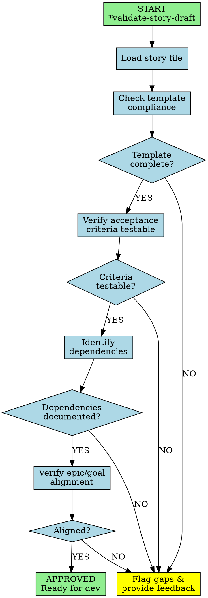
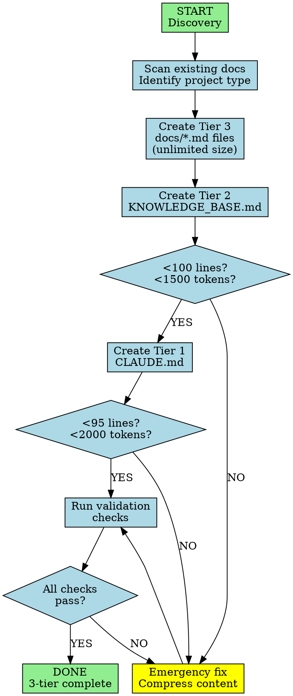
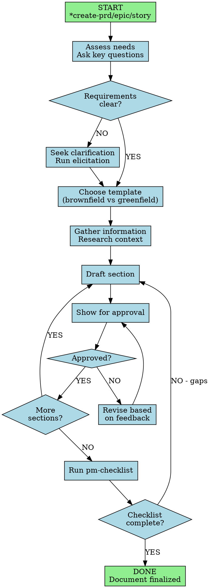

# Plan: Add Digraphs to 3 Agents and Optimize Content

## Objective
Add workflow digraphs to backlog-manager, context-builder, and feature-planner agents while removing redundant/verbose content to improve clarity and scannability.

## Analysis Summary

### Agent 1: backlog-manager.md (98 lines)
**Current State**: Has 4 operational workflows described in text. Clean and concise overall.

**Digraph to Add**: Story Validation Workflow
- Most critical procedural workflow with clear decision gates
- Shows validation checks: template → criteria → dependencies → alignment → pass/fail
- Captures escalation paths for common failure scenarios

**Content to Remove/Condense** (~15 lines reduction):
- Lines 82-96: "Communication & Quality Assurance" section is verbose
- Condense "Before finalizing" and "Escalation triggers" bullet lists into more compact format
- Quality Standards section could become a table

### Agent 2: context-builder.md (292 lines - LONGEST)
**Current State**: Extremely verbose with massive repetition. Same concepts explained 4-5 times.

**Digraph to Add**: 3-Tier Creation Workflow
- Shows sequential workflow: Discovery → Tier 3 → Tier 2 → Tier 1 → Validation
- Includes size limit checks at each tier with emergency response branches
- Visualizes the progressive disclosure architecture

**Content to Remove** (~100+ lines reduction):
- Lines 202-218: "Common Mistakes" - redundant with Anti-Patterns and Decision Matrix
- Lines 220-248: "Validation Checklist" - redundant with Success Criteria (250-259)
- Lines 261-279: "Emergency Response" - can be condensed to 1/3 size
- Lines 56-87: Tier 3 file details - over-specified, can be bullet lists
- Lines 90-117: KNOWLEDGE_BASE.md example - too verbose, condense
- Lines 127-163: CLAUDE.md example - too verbose, condense
- Lines 184-200: "Decision Matrix" - useful but could be more compact

**Target**: Reduce from 292 lines to ~150-180 lines

### Agent 3: feature-planner.md (83 lines)
**Current State**: Already concise. Clean structure.

**Digraph to Add**: Document Creation Workflow
- Shows iterative PRD/epic/story creation loop
- Includes approval gates, clarification branches, and checklist validation
- Captures the consultative/iterative nature with feedback loops

**Content to Remove** (~5-10 lines reduction):
- "Workflow Patterns" section (lines 45-55) will be partly replaced by digraph
- Can condense "Output Expectations" (lines 73-80) slightly

## Detailed Implementation Plan

### Phase 1: backlog-manager.md

**Step 1.1**: Insert digraph after line 8 (after intro paragraph)


**Step 1.2**: Condense lines 82-96
- Convert bullet lists to table format
- Remove repetitive "Before finalizing" explanations
- Reduce from 15 lines to ~8 lines

**Step 1.3**: Convert Quality Standards (lines 74-80) to compact table

### Phase 2: context-builder.md (MAJOR SURGERY)

**Step 2.1**: Insert digraph after line 8


**Step 2.2**: Remove/condense redundant sections
- Delete lines 202-218 (Common Mistakes - covered in Anti-Patterns)
- Delete lines 220-248 (Validation Checklist - covered in Success Criteria)
- Condense lines 261-279 (Emergency Response) from 19 lines to ~7 lines
- Condense Tier 3 examples (lines 56-87) from 32 lines to ~12 lines
- Condense Tier 2 example (lines 90-117) from 28 lines to ~10 lines
- Condense Tier 1 example (lines 127-163) from 37 lines to ~15 lines
- Keep Decision Matrix (184-200) but make more compact

**Target reduction**: 292 lines → ~160 lines

### Phase 3: feature-planner.md

**Step 3.1**: Insert digraph after line 8


**Step 3.2**: Condense "Workflow Patterns" section (lines 45-55)
- Since digraph now visualizes the workflow, reduce text explanation
- Keep key points but remove procedural details now in diagram
- Reduce from 11 lines to ~5 lines

**Step 3.3**: Slightly condense "Output Expectations" (lines 73-80)
- Already concise, minor cleanup only

## Critical Files

### Files to Modify:
1. `/home/hamr/Documents/PycharmProjects/agentic-toolkit/ai/subagentic/claude/agents/backlog-manager.md`
2. `/home/hamr/Documents/PycharmProjects/agentic-toolkit/ai/subagentic/claude/agents/context-builder.md`
3. `/home/hamr/Documents/PycharmProjects/agentic-toolkit/ai/subagentic/claude/agents/feature-planner.md`

### Reference File (for digraph format):
- `/home/hamr/Documents/PycharmProjects/agentic-toolkit/ai/subagentic/claude/agents/code-developer.md`

## Verification Steps

After each agent update:

1. **Visual inspection**: Ensure digraph renders correctly (```dot block)
2. **Line count check**:
   ```bash
   wc -l backlog-manager.md  # Target: ~85 lines
   wc -l context-builder.md   # Target: ~160 lines
   wc -l feature-planner.md   # Target: ~75 lines
   ```
3. **Content integrity**: Verify all essential information preserved
4. **No broken references**: Check that removed sections aren't referenced elsewhere
5. **Readability**: Confirm flow is improved, not degraded

## Trade-offs & Considerations

**Pros:**
- Digraphs provide instant visual understanding of complex workflows
- Reduced redundancy improves scannability
- More concise agents are easier to maintain
- Visual learners benefit significantly

**Cons:**
- Digraphs take more vertical space initially
- Some users prefer text explanations to diagrams
- context-builder has heavy surgery - need careful review

**Mitigation:**
- Place digraphs early (after intro) so they're seen first
- Keep essential text explanations alongside diagrams
- Review context-builder changes carefully for accidental information loss

## User Approval

✅ **Full reduction approved** for context-builder (292→160 lines)
✅ **All 3 agents approved** for digraph addition and optimization

## Success Criteria

✅ Each agent has a clear, accurate workflow digraph
✅ backlog-manager reduced by ~10-15 lines (98→~85 lines)
✅ context-builder reduced by ~100-130 lines (292→~160 lines) - FULL SURGERY
✅ feature-planner reduced by ~5-10 lines (83→~75 lines)
✅ No essential information lost
✅ Improved readability and scannability
✅ Digraphs follow same format as code-developer.md

## Execution Order

1. **backlog-manager** (warm-up - moderate changes)
2. **feature-planner** (practice - minor changes)
3. **context-builder** (final - major surgery)
